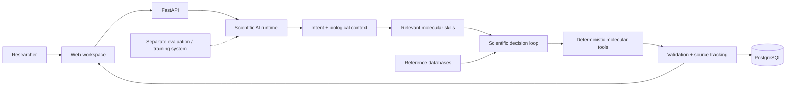

# LabOS — AI-Assisted Molecular Biology Platform

> **Public technical showcase.** The active research codebase remains private.

[Development history](DEVELOPMENT_HISTORY.md) — milestones from the private Git/PR history since July 2026.

LabOS is a research tool for turning molecular-biology objectives into structured, testable workflows across:

- **36 cloning and DNA-construction methods**
- **CRISPR workflows** including knockout, CRISPANT, knock-in, full deletion and shared-target designs
- sequence and construct analysis
- primer/PCR design and construct validation
- laboratory sequence/plasmid management
- multiple organism and experimental contexts
- in vivo and in vitro workflows
- cloning-method selection that can consider available laboratory materials and user preferences

The early CRISPR platform combined deterministic molecular services with GPT-assisted biological interpretation. When the unified LangGraph molecular runtime was introduced, it used **one persistent scientific AI with dynamically composed domain skills from the outset**. For this workstation-style molecular-design system, this is deliberately better suited than a multi-agent architecture: one specialist retains the complete biological objective, laboratory context, prior decisions and deterministic evidence across the workflow, while only the required molecular skills are switched in and out. This reduces context fragmentation between separate agents while still allowing specialised cloning, CRISPR and analysis behaviour.

AI handles biological interpretation, workflow selection and replanning. Established deterministic tools perform exact sequence operations, molecular calculations, primer design and validation.

## Why I built it

Molecular-design work often requires moving between literature, sequence databases, plasmid files, CRISPR tools, primer software and method-specific troubleshooting information. It can also involve several rounds of in-silico simulation and file creation.

LabOS brings these steps into one workflow while separating **AI scientific reasoning** from **deterministic molecular calculations**.

## Research basis

The cloning reasoning layer was developed through a method-by-method evidence review rather than from a small set of textbook protocols.

A separate Custom GPT with deterministic tools and API access was built to help conduct and structure this research.

| Research layer | Scale |
|---|---:|
| Cloning / DNA-construction methods reviewed | **36** |
| Retained source-method evidence instances | **≥987** |
| Explicitly classified primary/method papers | **≥414** |
| Structured practical observations, failure modes and rescue strategies | **860** |
| Deduplicated reusable capability classes | **77** |

The evidence also included manufacturer documentation, protocols, standards, software resources, repositories and targeted troubleshooting searches. Discussion/community sources were used mainly to identify practical failure modes and search gaps rather than as the main scientific authority.

> **Counting note:** ≥987 refers to retained source-method evidence instances across all 36 method dossiers. It is not a claim of 987 unique papers for each method.

## Architecture



## Implemented capability areas

- **Cloning and construct design** — restriction cloning, Gibson/seamless assembly, Golden Gate/MoClo, Gateway, USER, PCR-derived workflows and additional method profiles.
- **CRISPR design** — knockout, CRISPANT, deletion, knock-in and shared-target workflows with activity and specificity evidence kept separate.
- **Primer and sequence work** — PCR/primer design, sequence handling, feature/translation checks and molecular identity checks.
- **Construct validation** — junction/full-plasmid validation planning, sequencing QC, repeat/hairpin checks and PCR-history-aware validation.
- **Laboratory data** — plasmid and sequence storage, import/search, reference resolution and source/material tracking.
- **Workflow control** — biological-intent routing, context resolution, multi-part tasks, deterministic completion checks and replanning.

## Selected scientific software

LabOS uses established scientific tools wherever mature implementations already exist:

- **pydna** — molecular handling, PCR and supported cloning chemistry
- **Primer3** — primer design/evaluation
- **DnaCauldron** — Golden Gate / MoClo assembly
- **CRISPRscan + CHOPCHOP** — CRISPR guide activity/cross-check evidence
- **Bowtie / crisprVerse** — specificity evidence
- **DNA Chisel** — repeat and hairpin analysis
- **ViennaRNA + OSTIR** — RNA structure/accessibility and bacterial translation initiation
- **mappy/minimap2 + pyspoa** — long-read/full-plasmid sequence QC
- **pySBOL3** — sequence and feature interoperability

## Technology stack

**Backend:** Python, FastAPI, Pydantic, SQLAlchemy, Alembic, PostgreSQL, LangGraph  
**Frontend:** Next.js, React, TypeScript  
**Scientific:** Biopython, pydna, Primer3 and specialist molecular-biology tools  
**Testing:** pytest, GitHub Actions and deterministic scientific regression tests

## Example workflow

[`examples/example_workflow.json`](examples/example_workflow.json) is a **synthetic example** showing the type of information passed through a LabOS task without exposing real laboratory sequences or unpublished constructs.

```text
Research objective
      ↓
Biological intent + context
      ↓
Relevant molecular skills
      ↓
AI selects a workflow
      ↓
Deterministic tools calculate/check exact molecular operations
      ↓
Validation
      ↓
Draft result + warnings + evidence
```

## Selected real code

To demonstrate that this is an implemented system rather than only an architecture description, this showcase includes small **real, non-sensitive excerpts from the private LabOS codebase**:

- [`selected_code/skill_registry_excerpt.py`](selected_code/skill_registry_excerpt.py) — shows how one persistent AI loads different molecular skills for different task types.
- [`selected_code/molecular_contract_excerpt.py`](selected_code/molecular_contract_excerpt.py) — shows part of the typed task/completion contract used by the molecular runtime.

Only small non-sensitive excerpts are published. Core scientific implementation, prompts, laboratory data and private research code remain private.

## API architecture

The private system is API-first. Major API areas include:

- laboratory inventory and sequences
- cloning, PCR and primer operations
- CRISPR design
- AI task execution
- construct validation and QC
- source/material tracking and task history

## Validation approach

LabOS is designed so that AI decisions do not replace deterministic molecular checks.

Validation includes:

- automated backend and molecular regression tests
- architecture/routing tests
- frontend production-build checks
- exact sequence/material checks
- independent scientific-tool outputs where appropriate
- fail-closed behaviour when required evidence is unavailable

Passing software checks does **not** mean a construct or CRISPR design has been experimentally validated.

## Demo

Screenshots and short videos will be added here.

Planned demonstrations:

1. **LabOS overview** — laboratory library → molecular task → result
2. **Example design workflow** — objective → AI decisions → deterministic tools → validation

## Separate evaluation / training system

A separate tool has been built for constructing, evaluating and storing molecular-design tasks for AI evaluation and future system improvement. Its internal training strategy is not included in this public showcase.

## Limitations

- Active research prototype.
- Outputs require appropriate scientific review and experimental validation.
- Some method/species combinations have deeper support than others.
- Some workflows depend on local or external scientific databases/tools.
- The architecture continues to evolve.

## Repository scope

This repository is a **public technical showcase**, not the full LabOS source repository.

It contains documentation, synthetic examples, selected real code excerpts and demonstration media. The active research codebase, laboratory data, unpublished sequences, internal prompts and private evaluation assets remain private.

For technical discussion or a guided demonstration, please contact the author through LinkedIn.
