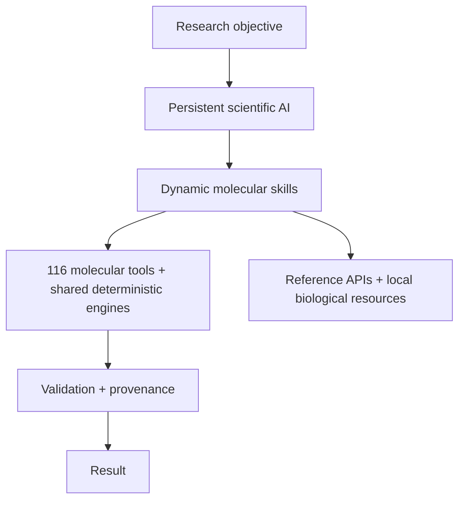

# LabOS — AI-Assisted Molecular Biology Platform

> **Public technical showcase.** The active research codebase remains private.

[Full capability index](CAPABILITY_INDEX.md) — evaluator-facing list of molecular tools, cloning methods, scientific software, APIs/data resources and workflow coverage.  
[Development history](DEVELOPMENT_HISTORY.md) — milestones from the private Git/PR history since July 2026.

LabOS is a research platform for turning molecular-biology objectives into structured, testable workflows across:

- **36 cloning and DNA-construction methods researched, grounded in 900+ source records**
- **CRISPR workflows** including knockout, CRISPANT, knock-in, full deletion and shared-target designs
- sequence, plasmid and construct analysis
- primer/PCR/qPCR design and construct validation
- laboratory plasmid, sequence and reagent management
- multi-species and workflow-context routing
- uses available laboratory materials in the library to choose feasible workflow routes
- **116 molecular tools backed by shared deterministic engines**

## System scale at a glance

| Capability | Scale |
|---|---:|
| Molecular tools | **116** registered tools backed by shared deterministic engines |
| Cloning methods researched | **36** method families |
| Species/workflow profiles | **16** reviewed profiles across **12** organism/context categories |
| Software integrations | **26** documented scientific backends: 20 audited core + 6 later integrated/optional backends |
| Database / reference resources | **5** external/reference-service paths plus local genome, annotation and index resources |
| Research evidence | **≥987** method-linked source records, including **≥414** primary/method papers; **~354,426 words** of synthesis |
| Practical research output | **860** implementation findings consolidated into **77** reusable engineering capabilities |

## AI architecture

The early CRISPR platform combined deterministic molecular services with GPT-assisted biological interpretation. When the unified LangGraph molecular runtime was introduced, it used **one persistent scientific AI with dynamically composed domain skills from the outset**. For this workstation-style molecular-design system, this is deliberately better suited than a multi-agent architecture: one specialist retains access to the complete biological objective, laboratory context, prior decisions and deterministic evidence across the workflow, while only the required molecular skills are switched in and out.

AI handles biological interpretation, workflow selection, evidence use and replanning. Established deterministic tools perform exact sequence operations, molecular calculations, primer design, assembly simulation and validation.

The model layer is provider-abstracted. Current live validation runs use the **Hermes provider path → OpenAI Codex provider → `gpt-5.6-terra`**, while the molecular graph, molecular-tool interface and scientific validation layer remain independent of a single model provider.

## Token-efficient orchestration

Long molecular workflows can become expensive if complete source evidence, sequence payloads and previous deterministic results are repeatedly sent back to the model. LabOS therefore includes code-level context and loop optimisation rather than relying only on shorter prompts.

The runtime selectively retains active molecular evidence while archiving inactive context, tracks exact temporary products, invalidates failed intermediate assemblies, preserves the current final construct for audit, and uses deterministic validation boundaries to reduce repeated model-tool cycling. Circular and multipart translated features are handled through the same feature-location machinery used elsewhere in the molecular stack so coordinate ambiguity does not trigger redundant audit loops.

A representative long molecular task was rerun after these changes:

| Runtime version | Model calls | Tool calls | Total tokens |
|---|---:|---:|---:|
| Earlier runtime | 13 | 11 | **1,046,320** |
| Optimised runtime | 10 | 8 | **459,246** |

That is a **~56% reduction in total token consumption** while retaining deterministic final-sequence validation. This is a measured task-level result, not a claim that every workflow will achieve the same reduction.

## Why I built it

Molecular-design work often requires moving between literature, sequence databases, plasmid files, CRISPR tools, primer software and method-specific troubleshooting information. It can also involve several rounds of in-silico simulation and file creation.

LabOS brings these steps into one workflow while separating **AI scientific reasoning** from **deterministic molecular calculations**.

## Research basis

The cloning reasoning layer was developed through a **method-by-method evidence-mining campaign**, rather than from a small set of textbook protocols.

A separate **private research AI system with deterministic tools and API access** was built specifically to conduct and structure this research. It is **not included in this public repository or in the active LabOS code repository**. The research system investigated each cloning methodology independently, reviewed and synthesized the evidence, extended searches into troubleshooting communities for failure-mode discovery/saturation, and generated one structured research report per method.

Across the 36 researched methods:

| Research layer | Scale |
|---|---:|
| Evidence reviewed | **≥987** method-linked source records, including **≥414** primary/method papers |
| Research synthesis | **~354,426 words** across the private method reports |
| Practical findings | **860** implementation findings, failure modes and rescue strategies → **77** reusable engineering capabilities |

The research funnel can be summarized as:

**36 methods → ≥987 method-linked source records reviewed → ~354k words of structured synthesis → 860 practical implementation findings → 77 reusable engineering capabilities**

The evidence stack included primary/method literature, manufacturer documentation, established protocols, standards, software/design resources, repositories, reviews and targeted troubleshooting searches. ResearchGate, specialist forums, Reddit and Q&A sources were used primarily to discover practical failure modes and test search saturation; high-confidence system behaviour was grounded in stronger evidence or deterministic sequence/chemistry checks wherever possible.

A representative private method report reviewed **more than 20 sources** and extracted structured route distinctions, failure modes, rescue strategies and cross-method alternatives. The full research reports are intentionally withheld because they encode unpublished research synthesis and implementation heuristics; a redacted excerpt can be shown during a guided technical walkthrough.

> **Counting note:** ≥987 is a count of **method-linked source records**, not 987 globally unique documents. A source can legitimately inform more than one method.

A **different** separate curriculum/evaluation system is used for controlled molecular-task collection, validation and future AI improvement; it is described below and should not be confused with the research AI that created the 36 method reports.

## Architecture

## Implemented capability areas

- **Cloning and construct design** — restriction cloning, Gibson/seamless assembly, Golden Gate/MoClo, Gateway/MultiSite Gateway, USER, yeast homologous-recombination assembly, PCR-derived workflows and additional method profiles.
- **CRISPR design** — knockout, CRISPANT, deletion, knock-in, base-editing, prime-editing and shared-target/conservation-aware workflows with activity and specificity evidence kept separate.
- **Primer and sequence work** — general PCR, qPCR, screening assays, Sanger planning, primer design/specificity, exact virtual PCR, sequence handling and feature/translation checks.
- **Construct validation** — exact final-sequence validation, junction/full-plasmid validation planning, sequencing QC, repeat/hairpin checks, read alignment and PCR-history-aware validation.
- **Comparative sequence analysis** — nucleotide/protein alignment, conservation analysis, paralogue/ohnologue and orthologue comparisons and source-coordinate mapping.
- **Laboratory data** — plasmid and sequence storage, FASTA/GenBank/SnapGene/raw-sequence import, reference resolution, inventory search and source/material tracking.
- **Workflow control** — biological-intent routing, species/context resolution, multi-part tasks, structured completion requirements, deterministic validation gates, repair/replanning and provenance-aware evidence handling.

## Selected scientific software

LabOS uses established scientific software wherever mature implementations already exist rather than recreating specialist algorithms unnecessarily. Representative components include:

- **Biopython + SnapGene Reader** — sequence/feature parsing and compound-location handling
- **pydna** — molecular handling, PCR and supported cloning chemistry
- **Primer3 / primer3-py** — primer design and thermodynamics
- **DnaCauldron** — Golden Gate / MoClo assembly
- **CRISPRscan + CHOPCHOP** — CRISPR guide activity/cross-check evidence
- **Bowtie + BLAST+** — CRISPR and primer/amplicon specificity searches
- **crisprVerse / crisprDesign / crisprScore** — R-based CRISPR analysis/scoring integration
- **PrimeDesign** — prime-editing design support
- **DNA Chisel** — sequence, motif, repeat and optimisation operations
- **MAFFT + MUSCLE** — nucleotide/protein multiple-sequence alignment
- **pLannotate** — provisional plasmid annotation
- **seqfold / ViennaRNA** — nucleic-acid structure calculations, with ViennaRNA isolated as an optional scientific sidecar
- **OSTIR** — optional bacterial translation-initiation/RBS backend
- **mappy/minimap2 + pyspoa** — long-read/full-plasmid sequence QC and consensus support
- **pySBOL3 / SBOL-utilities** — sequence/feature interoperability

Some additional adapters remain installed, catalogued or research-stage and are not presented as production scientific backends until exercised and validated. Statuses are separated explicitly in the [capability index](CAPABILITY_INDEX.md).

## Reference APIs and biological data

The platform is API-first but also deliberately supports local/versioned biological resources so an external service is not silently treated as authoritative when exact sequence provenance matters.

Current architecture includes:

- **Ensembl REST / Ensembl reference data** for gene, transcript, exon/CDS and reference-sequence resolution
- **NCBI / PubMed E-utilities** for reference and literature evidence retrieval, including explicit accession/version sequence retrieval
- **ZFIN and UniProt client/reference paths when configured** for organism/gene/protein cross-reference evidence
- exact **Addgene-linked records already stored in LabOS**, without guessing or scraping absent authoritative plasmid sequences
- imported **GTF/GFF3 annotations** and local reference-genome/index assets for deterministic sequence work
- laboratory **PostgreSQL plasmid, sequence, feature, primer, construct and inventory data**
- curated codon-usage, cloning-method, species/workflow and validation-rule datasets
- local CRISPRscan/CHOPCHOP/Bowtie/BLAST execution paths where appropriate rather than assuming unsupported public REST APIs

## Technology stack

**Backend:** Python, FastAPI, Pydantic, SQLAlchemy, Alembic, PostgreSQL, LangGraph  
**Frontend:** Next.js, React, TypeScript  
**Scientific:** Biopython, pydna, Primer3 and specialist molecular-biology backends  
**AI/provider:** provider-abstracted conversation runtime; Hermes route used for current `gpt-5.6-terra` validation runs  
**Interoperability:** OpenAPI/JSON APIs, Custom GPT Actions surface, biological sequence formats and SBOL-related tooling  
**Testing:** pytest, GitHub Actions, architecture/routing tests and deterministic scientific regression suites

## API architecture

The private system is API-first and exposes structured service surfaces for:

- laboratory inventory, plasmids, sequences and features
- file import and sequence viewing
- cloning, PCR/qPCR, primer and assembly operations
- CRISPR design and exact edit reconstruction
- AI molecular task execution
- construct validation and QC
- reference/evidence retrieval
- source/material tracking and task history
- **Custom GPT Actions** for task planning, context retrieval and design-task execution

The public showcase does not expose private endpoints, credentials, laboratory records or unpublished sequence data. See [CAPABILITY_INDEX.md](CAPABILITY_INDEX.md) for the public evaluator-facing integration inventory.

## Selected real code

To demonstrate that this is an implemented system rather than only an architecture description, this showcase includes small **real, non-sensitive excerpts from the private LabOS codebase**:

- [`selected_code/skill_registry_excerpt.py`](selected_code/skill_registry_excerpt.py) — shows how one persistent AI loads different molecular skills for different task types.
- [`selected_code/molecular_contract_excerpt.py`](selected_code/molecular_contract_excerpt.py) — shows part of the structured task/completion definition used by the molecular runtime.

Only small non-sensitive excerpts are published. Core scientific implementation, prompts, laboratory data and private research code remain private.

## Validation approach

LabOS is designed so that AI decisions do not replace deterministic molecular checks.

Validation includes:

- automated backend and molecular regression tests
- architecture/routing tests
- frontend production-build checks
- exact sequence/material checks
- independent scientific-tool outputs where appropriate
- fail-closed behaviour when required evidence is unavailable
- exact-product provenance through iterative assembly/repair cycles

Passing software checks does **not** mean a construct or CRISPR design has been experimentally validated.

## Separate Custom-GPT teacher / evaluation system

A separate curriculum service was built for **supervised molecular-task collection and model evaluation**. This is distinct from the private AI research system that generated the 36 method reports. Scientific reasoning still runs in the main MolecularDesignGraph; the teacher service schedules work and captures observable outputs rather than becoming a second scientific agent.

Its architecture separates:

- the **Custom GPT teacher surface**
- a dedicated **training PostgreSQL database**
- the main molecular runtime through a separate server-to-server credential
- a physically separate **validator PostgreSQL database** containing protected targets/evaluators
- human review/approval before positive training export
- held-out validation/test data that cannot be promoted into training data

The system can export structured transition, preference, negative, alternative, repair and held-out examples while keeping failed decisions out of positive training targets. This provides a controlled route for evaluating and improving the molecular AI without allowing the teacher to inspect hidden answer keys or modify the production laboratory database.

## Demo

Screenshots and short videos will be added here.

Planned demonstrations:

1. **LabOS overview** — laboratory library → molecular task → result
2. **Example design workflow** — objective → AI decisions → deterministic tools → validation
3. **Research-corpus evidence** — a redacted method-research excerpt showing research scale without publishing the private synthesis

## Limitations

- Active research prototype.
- Outputs require appropriate scientific review and experimental validation.
- Some method/species combinations have deeper support than others.
- Some workflows depend on local or external scientific databases/tools.
- The architecture continues to evolve.

## Repository scope

This repository is a **public technical showcase**, not the full LabOS source repository.

It contains documentation, synthetic examples, selected real code excerpts and demonstration media. The active research codebase, complete method research reports, laboratory data, unpublished sequences, internal prompts, provider credentials and private evaluation assets remain private.

For technical discussion or a guided demonstration, please contact the author through LinkedIn.