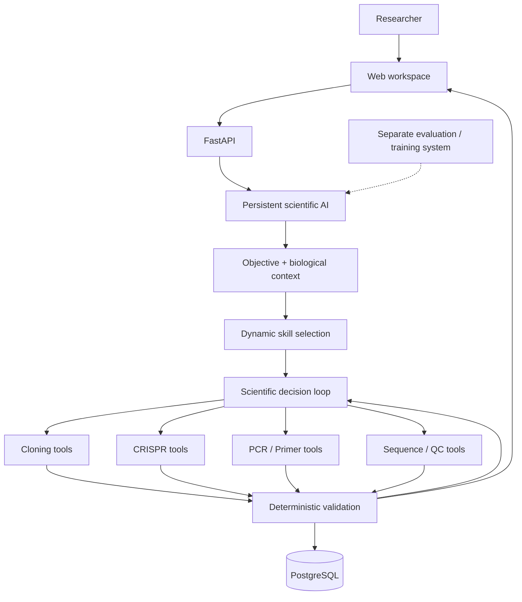

# LabOS Architecture

LabOS uses one persistent scientific AI and loads the domain skills needed for the current molecular task.

## Core design rule

**AI interprets and chooses; deterministic scientific tools calculate and verify.**

The molecular runtime was consolidated from earlier multi-agent experiments into one persistent AI so that context is retained across the complete task while domain abilities can be loaded dynamically.
